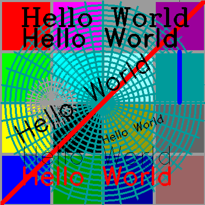

## M_pixel - low level pixel graphics library
# UNDER CONSTRUCTION
# UNDER CONSTRUCTION
# UNDER CONSTRUCTION

# UNDER CONSTRUCTION
# UNDER CONSTRUCTION
# UNDER CONSTRUCTION

## DESCRIPTION
This is a library that creates pixel images with a base
vector-oriented graphics library that emulates a subset
of the M_draw vector graphics library.

## BUILDING THE MODULES
     git clone https://github.com/urbanjost/M_pixel.git
     cd M_pixel/src
     # change Makefile if not using gfortran(1)
     make

This will compile the Fortran and basic example programs that exercise
the routines.

While you are there, you might want to generate a text version of the
documentation as well:

    # show all manpages as text
    env MANWIDTH=80 MANPATH=../man man --regex '.*' |col -b|tee man.txt

## NOTES

## USER DOCUMENTATION
   - a simple [index](https://urbanjost.github.io/M_pixel/) to
     the individual manpages in HTML form

   - A single page that uses javascript to combine all the HTML
     descriptions of the manpages is at 
     [BOOK_M_pixel](https://urbanjost.github.io/M_pixel/BOOK_M_pixel.html).

## ADDITIONAL DIRECTORY DESCRIPTIONS
There are 
    - manpages in the man/man3 directory 
    - HTML documentation in the docs/ directory.
    - demo programs in the test/ directory

## UNIT TESTS
There are no automated unit tests per-se. Running the example programs
and demo programs ensures the library is functioning.

## FUTURE
   There are higher-level routines based on this library not yet available
   on github. Ultimately the hope is to release this as an fpm package
   as described at [https://fortran-lang.org](https://fortran-lang.org)
   and then to release the higher-level routines as separate distributions
   on top of this.

   An example program already using this low-level library
   to generate higher-level graphics:

      

