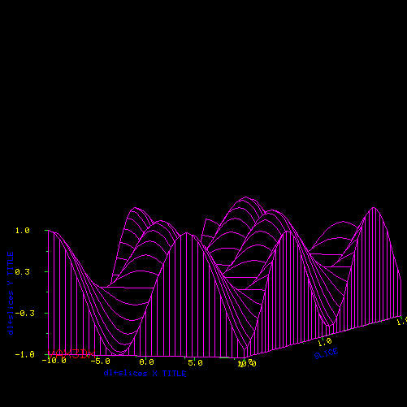

## M_pixel - low level pixel graphics library

## DESCRIPTION
This is a library that creates pixel images with a vector-oriented
graphics library that emulates a subset of the M_draw vector graphics
library. It is supplemented with additional modules that read and write
GIF files, including animated GIFs.

The user may supplemment the routines by directly manipulating the pixel
map as well.

## BUILDING THE MODULES
     git clone https://github.com/urbanjost/M_pixel.git
     cd M_pixel/src
     # change Makefile if not using gfortran(1)
     make

This will compile the Fortran and basic example programs that exercise
the routines.

## USER DOCUMENTATION
   - an [index](https://urbanjost.github.io/M_pixel/man3.html) to
     the individual manpages in HTML form

   - A single page that uses javascript to combine all the HTML
     descriptions of the manpages is at 
     [BOOK_M_pixel](https://urbanjost.github.io/M_pixel/BOOK_M_pixel.html).

## ADDITIONAL DIRECTORY DESCRIPTIONS
There are 
   - manpages in [docs/manpages.tgz](docs/manpages.tgz) and [docs/manpages.zip](docs/manpages.zip)
   - demo programs in the demos/ directory
   - applications in the app/ directory

## UNIT TESTS
There are no automated unit tests per-se. Running the example programs
and demo programs ensures the library is functioning.

## FUTURE
There are a collection of higher-level routines that need added, as well
as more font support, and antialiasing and basic pixel operations (the
library currently primarily provides two-dimensional vector-like commands).

An example program using this low-level library to generate higher-level
graphics:

